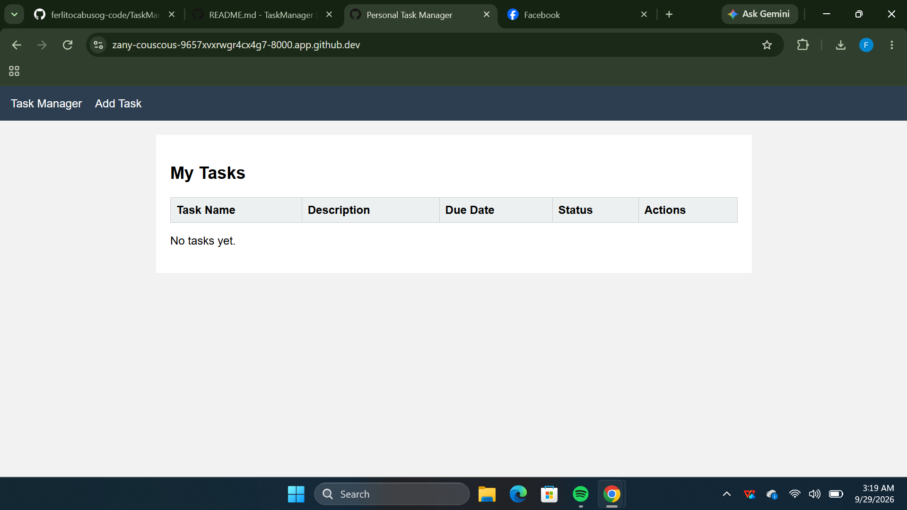
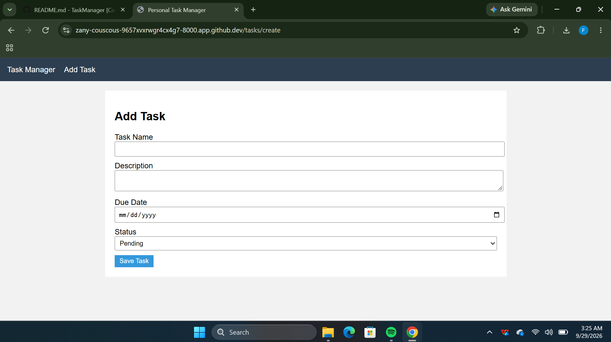
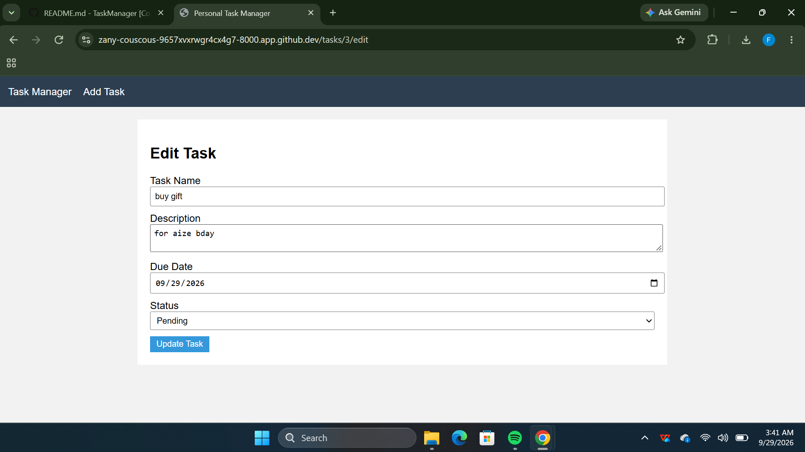
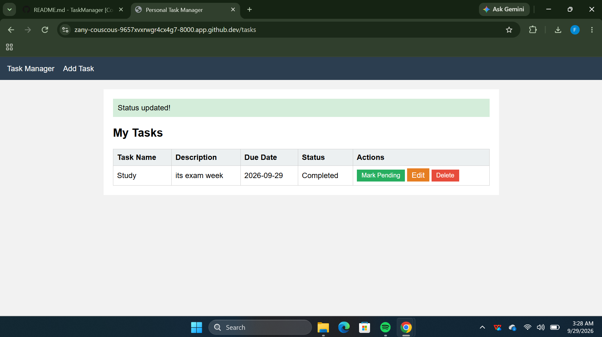
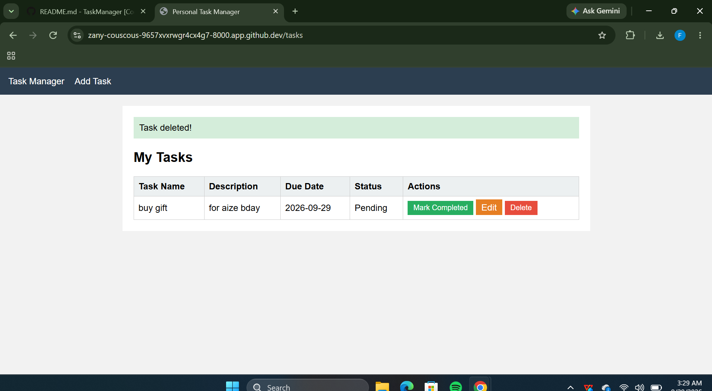
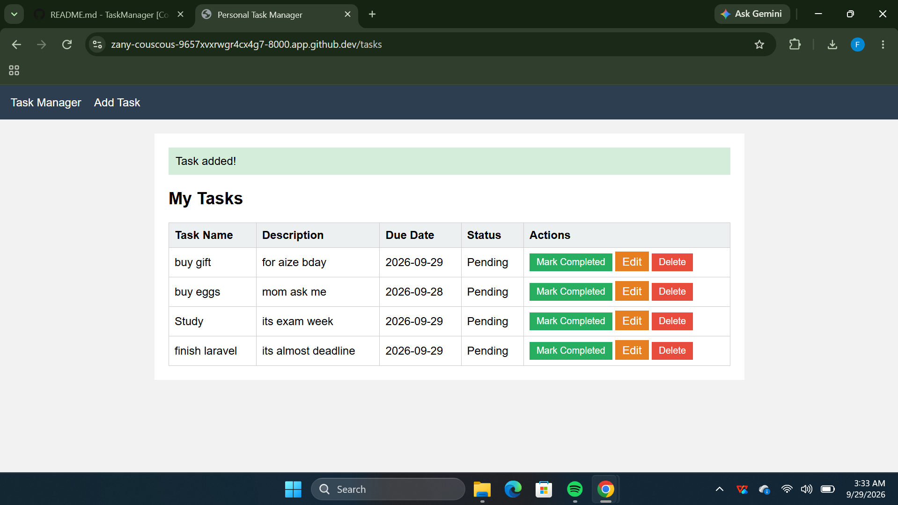

# Personal Task Manager

- Project Code: WST21-PM-2026-SF
- Student Name: CABUSOG, FERLITO JR C.
- Course & Year: BSIT - 2
- Database Used: SQLite

Features:
- Add Task
- View Tasks
- Edit Task
- Delete Task
- Update Status

## How the System Works (Step by Step)

### Step 1: Task List
When you first open the system, the task list is shown. If there are no tasks yet, it shows "No tasks yet."

### Step 2: Add a Task
1. Click **Add Task**.
2. Fill in the task name, description, status, and due date.
3. Click **Save Task**.

### Step 3: Edit a Task
1. Click **Edit** beside the task.
2. Change the information.
3. Click **Update Task**.

### Step 4: Update Status
Click **Mark Completed** beside a task to change it from Pending to Completed. Click **Mark Pending** to change it back.

### Step 5: Delete a Task
Click **Delete** beside the task to remove it from the list.

---

## Output

